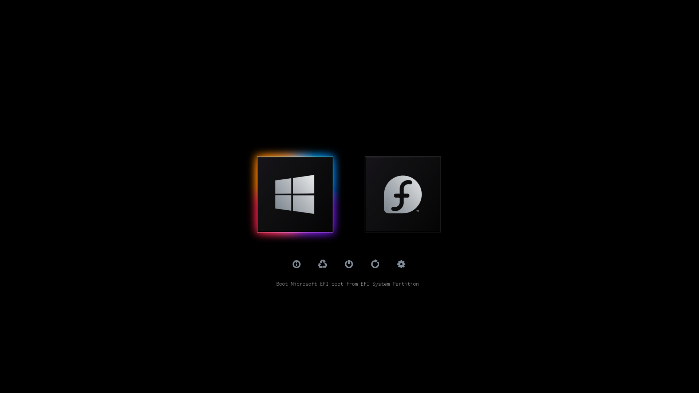

# BsxM1 theme for rEFInd

### Credits

[BsxM1](https://github.com/blackosx/BsxM1) OpenCanopy theme by BlackOSX 

Some icons and fonts from [Regular](https://github.com/1j01/refind-theme-regular) theme by munlik/bobafetthotmail/1j01.

"Ported" to rEFInd by AlexFullmoon (I simply converted icns to png and renamed some files)

### Content

Icons come in two sizes (128 and 256 px), OS selector in five colors. See options in theme.conf.

Folder `icons-leftovers` contains some unused icons due to differences between OC and rEFInd. They can be safely deleted.lmao
